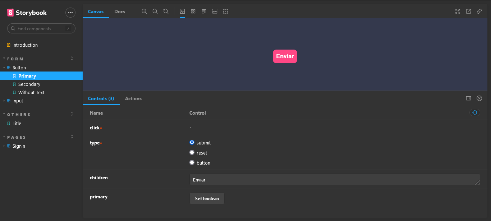

  
  <h1>
    demo-react-storyboook
  </h1>

<h2 align="center">
  Uma demonstração prática do uso do Storybook na documentação de projetos
</h2>

  <a href="#o-que-é-storybook">O que é Storybook</a>&nbsp;&nbsp;&nbsp;|&nbsp;&nbsp;&nbsp;
  <a href="#configurando-o-storybook-em-seu-projeto">Configurando o Storybook em seu projeto</a>&nbsp;&nbsp;&nbsp;|&nbsp;&nbsp;&nbsp;
  <a href="#sobre-o-projeto">Sobre o projeto</a>&nbsp;&nbsp;&nbsp;|&nbsp;&nbsp;&nbsp;
  <a href="#get-started">Get Started</a>&nbsp;&nbsp;&nbsp;|&nbsp;&nbsp;&nbsp;
  <a href="#licença">Licença</a>

---

## O que é Storybook
Storybook é uma ferramenta open source para a documentação de projetos frontend voltadas para o desenvolvedor, essa ferramenta permite a documentação dos componentes e páginas do seu projeto facilitando a colaboração entres os desenvolvedores da sua equipe.

## Configurando o Storybook em seu projeto
Para configurar o Storybook em seu projeto react basta executar o comando `npx sb init` para detectar a estrutura do seu projeto e baixar as devidas dependências, em seguia execute o comando `npm run storybook` ou `yarn storybook` para criar a estrutura inicial de estórias ou sempre que quiser abrir a interface de documentação para consultar alguma estória criada.
As instruções descritas acima foram usadas para implementar o storybook neste projeto, antes de usa-las em seu projeto consulte a documentação oficial para confirmar se os passos de configuração permanecem os mesmos. [storybook](https://storybook.js.org/docs/react/get-started/install)

## Sobre o projeto
Este projeto é uma demonstração dos recursos básicos do storybook na documentação de projetos frontend. Foram criados três componentes para serem documentados, um componente de titulo, um botão, e um campo input, esses três componentes foram usados em uma tela de simulação de login conforme demonstrado em imagem abaixo.

  

Após a criação da página de simulação e todas as suas devidas dependências, as estórias para a documentação deste projeto foram implementadas dentro da pasta [storybook/stories](.storybook/stories). A tela inicial que apresenta as estórias criadas é demonstrada na imagem abaixo.

  

## Get Started

Para visualizar as implementações deste projeto siga as etapas abaixo:
- Clone este repositório para sua maquina local
- Acesse o projeto pelo terminal de sua escolha e execute o comando `yarn` ou `npm install` para baixar as dependências (isso pode levar algum tempo)
- Use o comando `yarn start` ou `npm run start` para iniciar o projeto e ver a página de exemplo
- Use o comando `yarn storybook` ou `npm run storybook` para iniciar o projeto de documentação (esta etapa não depende da etapa anterior)

## Licença
Esse projeto está sob licença MIT, veja o arquivo de [LICENSE](./LICENSE) para mais detalhes

___
By Mauricio Redmerski André
